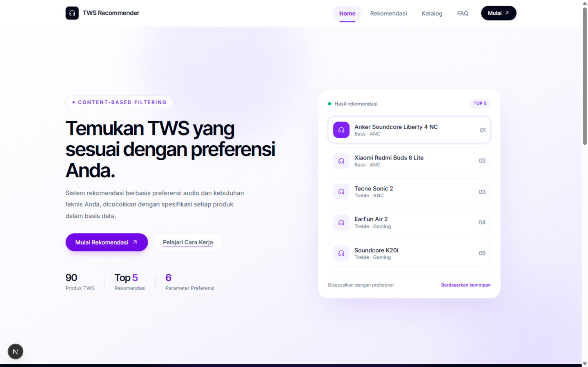
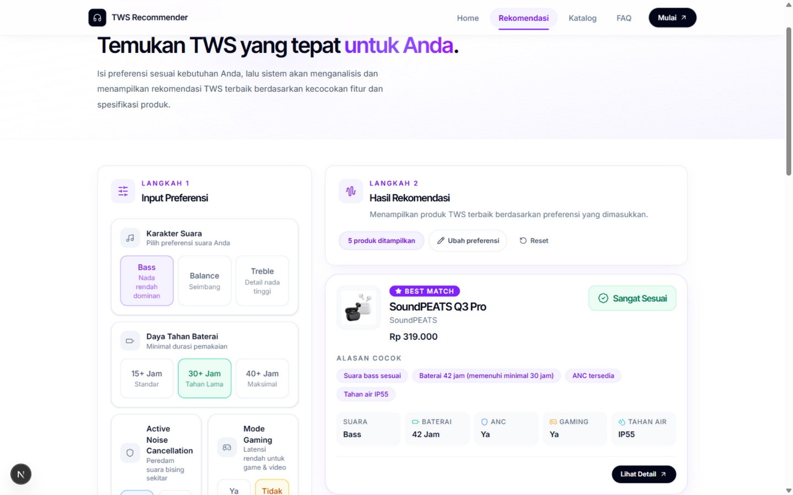

# TWS Recommender



TWS Recommender adalah proyek iseng-isengan yang berangkat dari masalah sehari-hari: milih earbuds di marketplace itu membingungkan. Pilihannya banyak, spesifikasi tidak pernah ditulis sejajar, dan kita sering cuma butuh beberapa hal tertentu — suara bass, baterai awet, atau yang aman buat olahraga.

Aplikasi ini mencoba merapikan masalah itu untuk lingkup yang lebih sempit: **TWS di bawah Rp1 juta**. Pengguna mengisi preferensi (karakter suara, daya tahan baterai, ANC, mode gaming, ketahanan air, dan budget), sistem mencocokkannya dengan spesifikasi tiap produk, lalu menampilkan lima rekomendasi teratas beserta alasan singkatnya.



Selain halaman rekomendasi, ada katalog untuk menelusuri seluruh produk (pencarian, filter harga dan brand, urutkan), halaman detail tiap produk, dan FAQ singkat soal istilah-istilah yang sering muncul di spesifikasi TWS.

## Cara Kerja

Rekomendasi dihitung di backend dengan pendekatan **content-based filtering** yang dibagi dua tahap:

1. **Penyaringan (hard constraint)** — produk yang harganya melebihi budget, baterainya di bawah minimum, atau ketahanan airnya tidak memenuhi langsung disingkirkan.
2. **Penilaian kemiripan** — produk yang lolos diubah menjadi vektor 7 dimensi (karakter suara one-hot `[bass, balance, treble]`, ANC, gaming, baterai, ketahanan air), lalu dihitung **cosine similarity**-nya terhadap vektor preferensi pengguna. Skor ini yang ditampilkan sebagai persentase kecocokan.

Beberapa keputusan desain di baliknya:

- Rating IP di-parse langsung dari stringnya mengikuti standar IEC 60529 (mis. `IP54` → debu 5, air 4), jadi tidak bergantung pada tabel yang berisiko lupa diperbarui.
- Fitur yang tidak diminta pengguna "dinetralkan" agar tidak menurunkan skor — produk dengan fitur ekstra tidak dihukum.
- Bluetooth dan codec tidak ikut dalam perhitungan skor; keduanya hanya ditampilkan sebagai informasi pelengkap.

## Teknologi

- **Backend:** FastAPI, MongoDB (PyMongo), Python 3.11+
- **Frontend:** Next.js 16 (App Router), React 19, Tailwind CSS v4, framer-motion
- **Dataset:** koleksi produk TWS di bawah Rp1 juta

## Struktur Project

```text
tws-recommender/
├── backend/      # API FastAPI, koneksi database, dan logika rekomendasi
├── frontend/     # Aplikasi web Next.js
├── docs/         # Screenshot untuk README
└── tws.json      # Dataset produk (lokal saja, tidak disertakan di repo)
```

## Menjalankan Project

### 1. Backend

```bash
cd backend
python -m venv venv
venv\Scripts\activate
pip install -r requirements.txt
```

Salin `backend/.env.example` menjadi `backend/.env`. Untuk pengembangan lokal, nilai default-nya sudah cukup selama MongoDB berjalan di `localhost:27017`. Lalu isi database dari dataset:

```bash
python -m scripts.seed
```

Jalankan server backend:

```bash
uvicorn app.main:app --reload
```

Backend berjalan di `http://localhost:8000`.

### 2. Frontend

```bash
cd frontend
npm install
```

Salin `frontend/.env.example` menjadi `frontend/.env.local` — opsional, karena tanpa file itu aplikasi memakai `http://localhost:8000` sebagai alamat API. Lalu jalankan:

```bash
npm run dev
```

Frontend berjalan di `http://localhost:3000`.

## Environment Variables

**Backend (`backend/.env`)**

| Variable | Deskripsi | Default |
| --- | --- | --- |
| `MONGODB_URL` | URI koneksi MongoDB | `mongodb://localhost:27017/` |
| `DB_NAME` | Nama database | `tws_recommender` |
| `COLLECTION_NAME` | Nama koleksi produk | `tws_products` |
| `CORS_ORIGINS` | Origin frontend yang diizinkan, dipisah koma | `http://localhost:3000` |

**Frontend (`frontend/.env.local`)**

| Variable | Deskripsi | Default |
| --- | --- | --- |
| `NEXT_PUBLIC_API_URL` | Base URL backend API | `http://localhost:8000` |
| `NEXT_PUBLIC_SITE_URL` | Base URL situs untuk metadata saat link dibagikan | `http://localhost:3000` |
| `IMAGE_REMOTE_HOSTS` | Host gambar eksternal untuk `next/image`, dipisah koma | kosong |

## Catatan

- Dataset `tws.json` dan gambar produk sengaja tidak disertakan di repo. Skrip seed membaca file tersebut dari root project, jadi siapkan datamu sendiri bila ingin mencoba — formatnya array of objects dengan skema yang sama seperti model `TWSModel` di `backend/app/models.py`.
- Ada skrip pengecekan layout sederhana untuk halaman-halaman utama (butuh `playwright` Python serta backend dan frontend yang sedang berjalan): `python frontend/scripts/visual_qa.py`.
